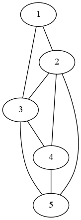

# Stuff about satisfiability

## Generate random CNFs

`random_cnf.py` generates random cnfs.

### Usage

```text
usage: random_cnf.py [-h] [-o output_dir] t n c k

Generates random CNFs.

positional arguments:
  t                     Number of CNFs
  n                     Number of variables
  c                     Number of clauses
  k                     Clause width

options:
  -h, --help            show this help message and exit
  -o output_dir, --output output_dir
                        Directory that the CNFs are written to
```

### Examples

```text
# generate 10 random 2-cnfs with 5 variables and 4 clauses each
python src/random_cnf.py 10 5 4 2 -o "random_cnfs"
# use a preset
bash presets/small_2cnf.sh
```

## DPLL

`dpll.py` checks if a CNF encoded with DIMACS is satisfiable.

### Usage

```text
usage: dpll.py [-h] input

Checks if a CNF is satisfiable.

positional arguments:
  input       Input file where DIMACS encoding of a formula is stored.

options:
  -h, --help  show this help message and exit
```

### Examples

```text
python src/dpll.py random_cnfs/random_cnf_0.txt
python src/dpll.py cnfs/unsatisfiable_cnf.txt
```

## Graph Encoding

- first line: `n_nodes n_edges`
- second line: all nodes (only integer values), separated by comma
- all lines after: edges in the form `from -- to` (edges are undirected)
- lines that start with \# are ignored

### Example

This is the house of saint nikolaus.

```text
# house of saint nikolaus
5 8
1, 2, 3, 4, 5
# roof
1 -- 2
1 -- 3
2 -- 3
# walls
3 -- 4
4 -- 5
5 -- 2
# diagonal
2 -- 4
3 -- 5
```

## Convert to DOT Encoding

`graph.py` reads a graph from a file and converts it into DOT encoding. The DOT encoding is saved in the `dot_encodings` directory (e.g. `graphs/graph_0.txt` -> `dot_encodings/graph_0.dot`).

### Usage

```text
usage: graph.py [-h] [--test] filename

Reads a graph from a file and saves it as a dot encoding.

positional arguments:
  filename    File with the encoded graph.

options:
  -h, --help  show this help message and exit
  --test      Tests the implementation (no other arguments needed).
```

### Examples

```text
python src/graph.py graphs/graph_0.txt
```

## Render Graphs

`render.sh` reads a graph from a file and renders it. The rendered image is saved in `.png` format in the `renders` directory (e.g. `graphs/graph_0.txt` -> `renders/render_graph_0.png`).

### Examples

```text
./render.sh graphs/graph_nikolaus.txt
```



Well that looks like a pretty house.

## Find Independent Sets

`independent_set.py` takes a graph and a parameter `k` and finds out if there is and independent set of nodes with size `k` in the given graph. You can also build CNFs that are equivalent to the Independent Set problem. Those CNFs are saved in the `cnfs` directory and include the original graph name and the parameter `k` (`graphs/graph_nikolaus.txt` -> `cnfs/ind_set_graph_nikolaus_k_2.txt`).

### Usage

```text
usage: independent_set.py [-h] [--cnf] [--test] filename k

Determines if there is an independent set of k nodes.

positional arguments:
  filename    File with the encoded graph.
  k           Number of independent nodes.

options:
  -h, --help  show this help message and exit
  --cnf       Builds and saves a cnf for the problem instead of solving it recursively.
  --test      Tests the implementation (no other arguments needed).
```

### Examples

```text
python src/independent_set.py graphs/graph_0.txt 3
```
